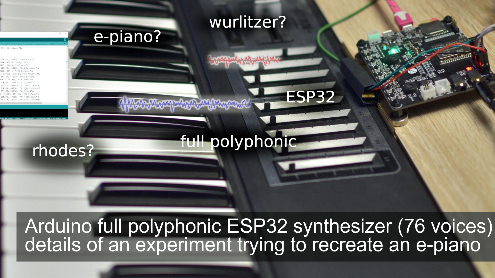

<h1 align="center">ml_epiano_example</h1>
<h3 align="center">Arduino full polyphonic ESP32 synthesizer (experimental e-piano)</h3>  

 
   
  <a href="https://youtu.be/m12w1Xtm5Ts">link to the video</a>

This project is an example supporting different platforms (soon):
- ESP32

The required library can be found here: https://github.com/marcel-licence/ML_SynthTools

Supported versions of board library
---
- ESP32 version 1.0.6 from https://github.com/espressif/arduino-esp32/releases/tag/1.0.6
Please be aware that other versions might be not supported.

More information will be available in future